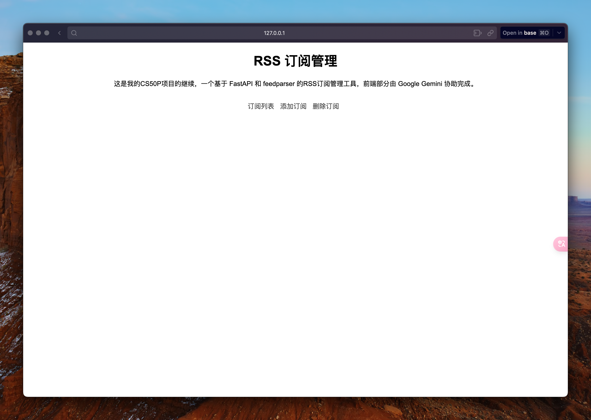
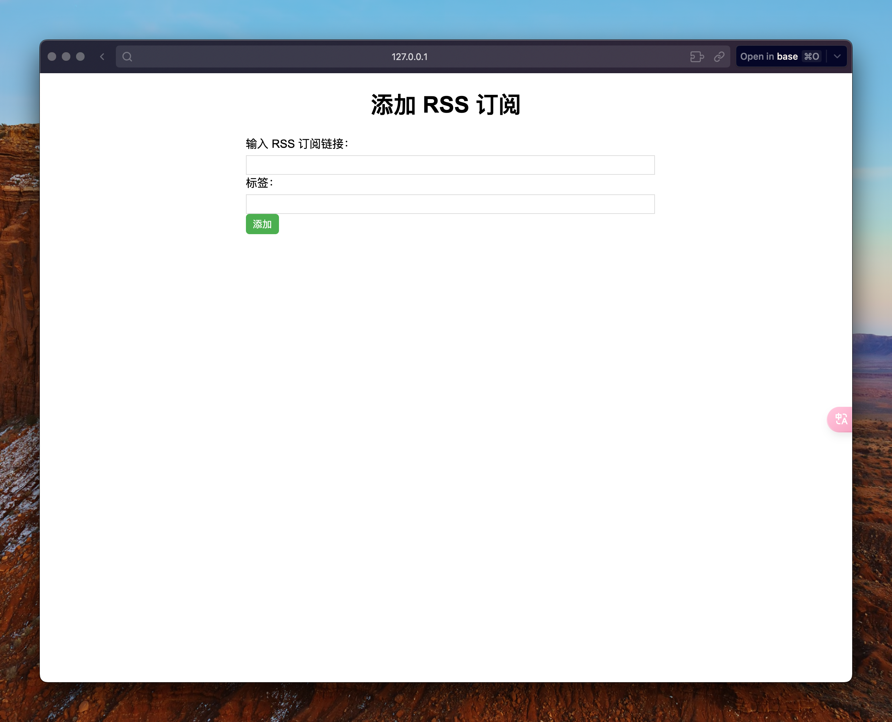
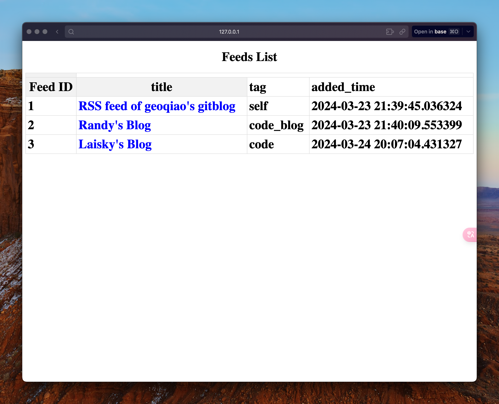
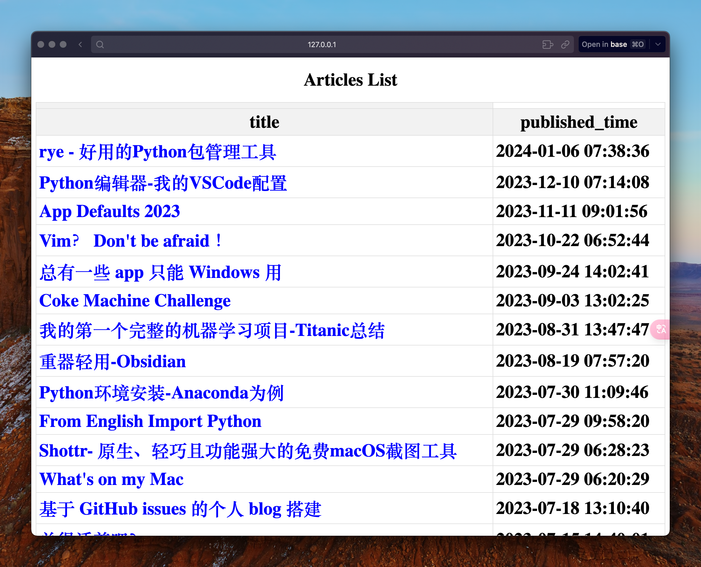
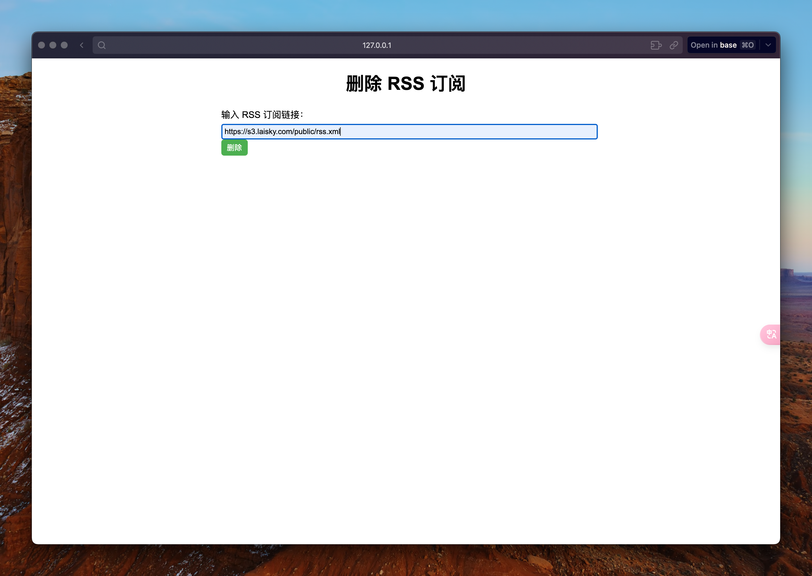

# rss-manager

这是一个基于 FastAPI 和 feedparser 的RSS订阅管理工具。他可以添加rss订阅到 SQLite 数据库，可以通过点击订阅列表的标题展示该订阅的所有文章。

## 首页

首页包含 Feeds List 和 添加订阅 页面的入口。

通过点击`订阅列表`和`添加订阅`可以进入相应界面

## 添加订阅

在此页面可以添加 RSS 订阅链接至一个 SQLite 数据库中。

## 订阅列表

在此页面可以查看已添加到数据库中的所有订阅，包含标题、添加时间、Tag等字段

通过点击不同的标题，可以查看对应RSS订阅中的所有文章列表。在文章列表点击文章标题可以跳转至原文网址。

## 删除订阅
在此页面可以删除已添加到数据库中的订阅

## TODO

- [X] 添加功能：添加删除订阅的功能
- [ ] 优化加载速度：当订阅内文章过多时，文章页面加载很慢，尝试优化加载速度（或者减少页面展示文章的数量）
- [ ] 优化页面展示：学一点前端知识，比如简单的 CSS 和 HTML
- [ ] 制作教程：作为初学者，写这个网页app真的不容易，很多没有吃透的知识计划通过写一篇教程来巩固